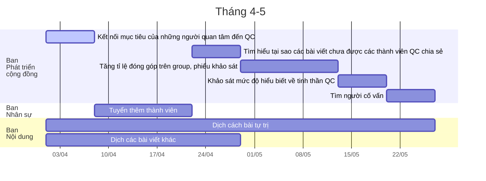
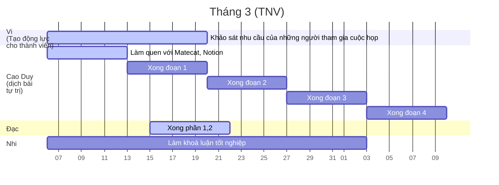

# Kế hoạch ngắn hạn
## Các công việc phải làm ngay
```dataview
list
From "1 Công việc" 
Where độ-cấp-thiết="Phải làm ngay" 
```

## Thông tin chi tiết
```dataview 
table 
	công-việc-thành-phần as "Công việc thành phần", 
	trạng-thái as "Trạng thái", 
	kết-quả-mong-muốn as "Kết quả mong muốn"
from "1 Công việc" 
where độ-cấp-thiết="Phải làm ngay"
```
# Kế hoạch trung hạn
```dataview
list
From "1 Công việc" 
Where độ-cấp-thiết="Muốn làm ngay" or độ-cấp-thiết="Nên làm ngay" 
```
![[Kế hoạch tổng thể supplement#Các công việc phải làm ngay muốn làm ngay hoặc nên làm ngay PNM]]
![[Tầm hoạt động theo công việc.png]]
[[Kết quả mong muốn đến cuối 12-2022]]
## Các công việc thành phần, trạng thái và kết quả mong muốn
```dataview 
table 
	công-việc-thành-phần as "Công việc thành phần", 
	trạng-thái as "Trạng thái", 
	kết-quả-mong-muốn as "Kết quả mong muốn"
from "1 Công việc" 
where độ-cấp-thiết="Phải làm ngay" or độ-cấp-thiết="Muốn làm ngay" or độ-cấp-thiết="Nên làm ngay" or độ-cấp-thiết="Công việc lặp lại"  
```
## Các mục tiêu và công việc cần hoàn thành trước và sau đó
```dataview
TABLE
	công-việc-thành-phần as "Công việc thành phần", 
	filter(file.inlinks, (i) => i.công-việc-thành-phần) as "Công việc lớn hơn", 
	filter(file.inlinks, (i) => i.hoạt-động) as "Phục vụ cho mục tiêu", 
	filter(file.inlinks, (i) => i.next) as "Công việc cần làm trước đó",
	next as "Công việc sẽ làm sau đó"
from "1 Công việc"   
where độ-cấp-thiết="Phải làm ngay" or độ-cấp-thiết="Muốn làm ngay" or độ-cấp-thiết="Nên làm ngay" or độ-cấp-thiết="Công việc lặp lại"  
Sort next
```

## Đồ thị Gantt




