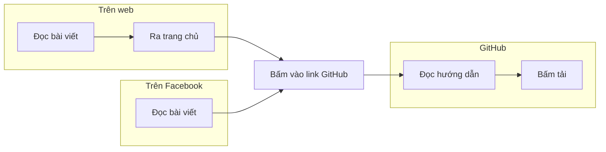

# Nguyên tắc phỏng vấn 
- Đặt các câu hỏi mở 
- Kiểm chứng điều chúng ta đã vẽ ra về người dùng 
- Luôn nhìn vào hành vi, đừng chỉ nhìn vào logic của người dùng.
- Tìm hiểu vào bối cảnh, không chỉ nhìn hành vi đơn lẻ.

# Làm quen
- Giới thiệu sơ về bản thân
- Điều gì khiến bạn quyết định tham gia buổi hôm nay?

# Nội dung chính
- Việc hiểu vault này có những gì có dễ dàng cho bạn ko? 
- Bạn cảm thấy vault này giúp ích bạn ở điều gì? 
- Những thứ nó giúp ích cho bạn có phải là những thứ quan trọng bạn cần có hay ko? 
- Việc sử dụng nó để đạt được mục tiêu của bạn có dễ dàng cho bạn ko?
- Bạn thấy nó cần cải thiện điều gì?
- Bạn đã đi qua những bước nào?
- Các phím tắt có quen thuộc không?
- Bạn cảm thấy ồ lên khi nào?

# Tổng kết
- Bạn đánh giá buổi hôm nay thế nào?