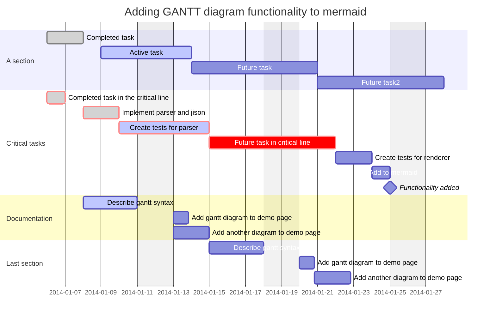

- [ ] Xem nội dung họp trong [[00.1 Lịch họp hằng tuần]]
- [ ] Lên danh sách chủ đề các buổi họp để mọi người lựa chọn
- [ ] Đăng thông báo lên group
	- [ ] Xác định ngày họp nhiều người tham gia được nhất
    - [ ] Tạo lịch Google Calendar
- [ ] [[Chọn nơi họp]]
- [ ] Khởi động một chút cho thêm không khí
- [ ] Tạo khảo sát cuối buổi
- [ ] Ghi chép

Nếu có mời đối tác khác vào họp chung:
- [ ] Chuẩn bị nội dung họp
- [ ] Chuẩn bị phiếu khảo sát nhu cầu của họ
- [ ] Gửi cho các bên nội dung họp

Nếu có thành viên online thì cần đảm bảo:
- [ ] Mở trước 5 phút
- [ ] Camera quan sát được cả nhóm
- [ ] Mic và loa rõ
- [ ] Màn hình để mọi người thấy được sự hiện diện của họ

Cấu trúc một cuộc họp 3 tiếng:
- 30 phút đầu: trò chuyện linh tinh, làm quen, chuẩn bị, chờ người đến trễ
- 30 phút cuối: mọi người đánh giá mức độ hài lòng trong buổi họp và đưa ra mong muốn cho buổi kế tiếp
	- Nãy giờ em thấy ấn tượng nhất ý nào/ý nào em thấy thích nhất
	- Có điều gì mình có thể làm tốt hơn ko
	- Còn thắc mắc vấn đề nào
