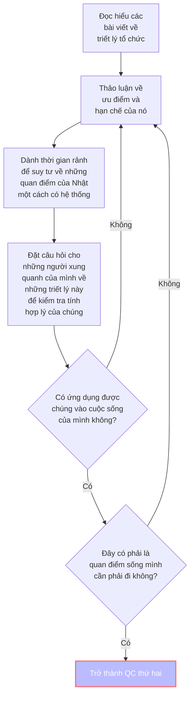

1. Tư duy, thái độ, ...
	- [[Một đám mây chim sáo]]
	- [[Sự trong trong]]
	- [[Truyện Ngụ Ngôn về Người Nhật – Phần Một (chưa chắc có Phần Hai)]]
		- [[66 Hướng dẫn xử lý các trường hợp cụ thể]]
	- [Mở đầu](https://xn--qucu-hr5aza.cc/mo-dau/?utm_source=Obsidian+Qu%E1%BA%A3+C%E1%BA%A7u+%C2%BB+B%E1%BA%A3n+%C4%91%E1%BB%93+trong+QC&utm_medium=M%E1%BB%9F+%C4%91%E1%BA%A7u&utm_campaign=Giai+%C4%91o%E1%BA%A1n+1)
2. Các khái niệm quan trọng khác
	- [Sự bất lực học được](https://xn--qucu-hr5aza.cc/su-bat-luc-hoc-duoc/?utm_source=Obsidian+Qu%E1%BA%A3+C%E1%BA%A7u+%C2%BB+B%E1%BA%A3n+%C4%91%E1%BB%93+trong+QC&utm_medium=S%E1%BB%B1+b%E1%BA%A5t+l%E1%BB%B1c+h%E1%BB%8Dc+%C4%91%C6%B0%E1%BB%A3c+l%C3%A0+g%C3%AC%3F&utm_campaign=Giai+%C4%91o%E1%BA%A1n+1)
	- [[Niềm tin tiêu cực]] 
Thảo luận về ưu điểm và hạn chế của nó
4. Dành thời gian rảnh để suy tư về những quan điểm của Nhật một cách có hệ thống
5. Đặt câu hỏi cho những người xung quanh của mình về những triết lý này để kiểm tra tính hợp lý của chúng
6. Ứng dụng chúng vào cuộc sống của mình
7. Cảm thấy đây là quan điểm sống mình cần phải đi
8. Nếu như 5, 6 không hiệu quả hoặc khả thi thì quay lại 2
