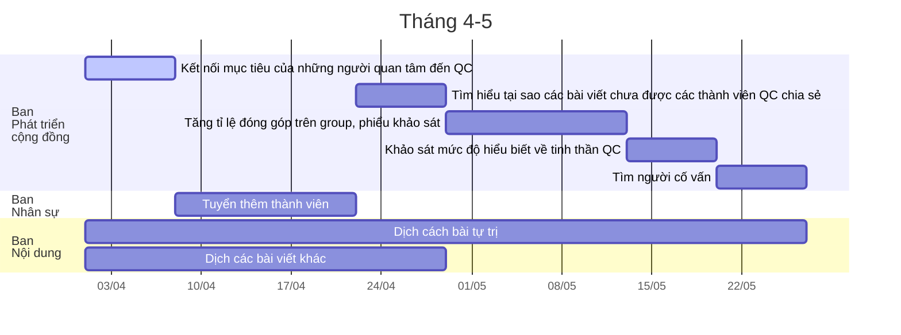

=== multi-column-start: basic Info
```column-settings
Number of Columns: 2
Border: off
Largest Column: right
```

![[Nhật.jpg]]

=== end-column ===

# Lý Minh Nhật 
Hình thức tham gia:: [[Người đứng đầu|Đỉa ngựa lông vàng 🐴]]
Kỹ năng:: [[Thiết kế, quản lý dự án]], [[Nghiên cứu (kỹ năng)]], [[Nhân sự (kỹ năng)]], [[Công nghệ thông tin]], [[Quản lý tài chính]]
📱:: 0912214006
🏠:: Q4, TPHCM
✉:: lyminhnhat911@gmail.com
🌐:: [Lý Minh Nhật – Human after all](https://lyminhnhat.com?utm_source=Obsidian+Qu%E1%BA%A3+C%E1%BA%A7u+%C2%BB+Nh%E1%BA%ADt&utm_medium=Homepage&utm_campaign=Homepage)
Facebook:: [Quả Cầu](https://www.facebook.com/qua.cau.the.sphere)
Kỹ năng:
- [[23 Dùng Git|Dùng Git]]: 🌕
- [[Dùng Obsidian]]: 🌕

=== multi-column-end

> [!tabbed-box]  
> <input id="1st1" type="radio" name="tab-group-1">
> <input id="1st2" type="radio" name="tab-group-1">
> <input id="1st3" type="radio" name="tab-group-1">
> <label for="1st1">Hoạt động của tôi trong QC</label>
> <label for="1st2">Hành trình của tôi trong QC</label>
> <label for="1st3">Thông tin khác về tôi</label>
> 
> > [!tabs]  
> > > [!tab-content]
>>>## Công việc tôi nhận làm
>>>```dataview
>>>list where contains(người-chơi,[[]]) and trạng-thái!="#tt-✔️/đãđánhgiá" 
>>>```
>>>## Công việc PNML trong các ban nhận làm
>>>```dataview
>>>List map(filter(file.inlinks, (f) => contains(f.ban, file.link) and (f.độ-cấp-thiết="#đct-🔥🔥Phảilàmngay" or f.độ-cấp-thiết="#đct-🔥/muốnlàmngay" or f.độ-cấp-thiết="#đct-🔥/nênlàmngay" or f.độ-cấp-thiết="Công việc lặp lại")), (x)=>x+" @" +x.người-chơi  )
>>>From "8 Tổ chức/61 Ban" 
>>>Where contains(this.ban, file.link)
>>>```
>>>
>>>## Công việc tôi đã làm xong
>>>```dataview
>>>list where contains(người-chơi,[[]]) and trạng-thái="#tt-✔️/đãđánhgiá" 
>>>```
> >
> > > [!tab-content]  
>>>## Hiểu kế hoạch chiến lược
>>>1. [x] Đọc hiểu:
>>>	- [x] [[4 Sản phẩm, kết quả mong muốn (các vùng đất)|Các mục tiêu dài hạn (Các dự án thành phần)]]
>>>	- [x] [[00.2 Kế hoạch tổng thể|Các mục tiêu ngắn hạn (Kế hoạch tổng thể)]]
>>>2. [x] Thấy được những mục tiêu này giúp ích gì cho bản thân mình hoặc nơi mình làm tổ chức mình
>>>3. [x] Tích hợp được những mục tiêu này vào cuộc sống của mình
>>>4. [x] Nếu như 2, 3 không hiệu quả hoặc khả thi thì đề xuất được một kế hoạch chiến lược khác
>>>## Hiểu triết lý tổ chức
>>>1. [x] Đọc hiểu các bài sau:
>>>	1. [x] Tư duy, thái độ, ...
>>>		- [x] [[Rhizome]]
>>>		- [x] [[Sự trong trong]]
>>>		- [x] [[83 Hướng dẫn xử lý các trường hợp cụ thể]]
>>>			- [x] [Mở đầu](https://xn--qucu-hr5aza.cc/mo-dau/?utm_source=Obsidian+Qu%E1%BA%A3+C%E1%BA%A7u+%C2%BB+H%C3%A0nh+tr%C3%ACnh+th%C3%A0nh+vi%C3%AAn&utm_medium=M%E1%BB%9F+%C4%91%E1%BA%A7u&utm_campaign=Giai+%C4%91o%E1%BA%A1n+1)
>>>	2. [x] Các khái niệm quan trọng khác
>>>		- [x] [Sự bất lực học được](https://xn--qucu-hr5aza.cc/su-bat-luc-hoc-duoc/?utm_source=Obsidian+Qu%E1%BA%A3+C%E1%BA%A7u+%C2%BB+H%C3%A0nh+tr%C3%ACnh+th%C3%A0nh+vi%C3%AAn&utm_medium=S%E1%BB%B1+b%E1%BA%A5t+l%E1%BB%B1c+h%E1%BB%8Dc+%C4%91%C6%B0%E1%BB%A3c+l%C3%A0+g%C3%AC%3F&utm_campaign=Giai+%C4%91o%E1%BA%A1n+1)
>>>		- [x] [[Niềm tin tiêu cực]] 
>>>2. [x] Thảo luận về ưu điểm và hạn chế của nó
>>>3. [x] Dành thời gian rảnh để suy tư về những quan điểm của Nhật một cách có hệ thống
>>>4. [x] Đặt câu hỏi cho những người xung quanh của mình về những triết lý này để kiểm tra tính hợp lý của chúng
>>>5. [x] Ứng dụng chúng vào cuộc sống của mình
>>>6. [x] Cảm thấy đây là quan điểm sống mình cần phải đi
>>>7. [x] Nếu như 5, 6 không hiệu quả hoặc khả thi thì quay lại 2
>>> ## Hiểu cách sự vận hành hiện tại
>>>- [x] Hiểu được, nắm được, biết được:
>>>	- [x] [[00.1 Lịch họp hằng tuần|Tuần này sẽ họp những gì]]
>>>	- [x] [[00.2 Kế hoạch tổng thể|Kế hoạch ngắn hạn của QC (các công việc PNML)]]
>>>	- [x] [[4 Sản phẩm, kết quả mong muốn (các vùng đất)|Kế hoạch dài hạn của QC]]
>>>	- [x] [[6 Các bên liên quan (NPC)/Cá nhân#1 Các bên liên quan đã hỗ trợ được QC|Những ai đóng góp cho QC]]
>>>	- [x] [[8 Tổ chức|Cơ cấu tổ chức và công việc trong ban mình muốn làm]] 
>>>	- [x] [[82 Thành viên (Người chơi)|Hồ sơ công việc của mình và của các thành viên khác]]
>>>	- [x] [[Cách tìm công việc phù hợp với mình nhất]]
>>>	- [x] [[83 Hướng dẫn xử lý các trường hợp cụ thể|Cách xử lý các tình huống khác nhau trong quá trình làm việc]]
>>>	- [x] [[Hướng dẫn truyền thông|Cách khi giới thiệu cho người ngoài]] 
>>>- [x] Thảo luận với các thành viên khác trong ban để chia công việc
>>>- [x] Nhận một công việc hoặc đề xuất một công việc phù hợp với mình
>>>- [x] Kết nối Google Calendar của mình với nhóm
>>> ## Tương tác với mọi người
>>>1. [x] Tham gia [[00.1 Lịch họp hằng tuần|các buổi họp hằng tuần]]
>>>2. [x] Tham gia [Discord](https://discord.gg/jWTk4EHFK2)
>>>3. [x] Tham gia [group](https://www.facebook.com/groups/thaydoiniemtintieucuc/)
>>>4. [x] Chia sẻ trên Discord/group	
>>>	- [x] Giới thiệu bản thân
>>>	- [x] Chia sẻ với mọi người về những gì mình đã, đang và sẽ làm/cần trong vòng 1 tháng qua và 1 tháng tới
>>>	- [x] Những bài viết mình thấy thú vị
>>>	- [x] Những suy tư của mình
>>>5. [x] Làm khảo sát [Bạn nghĩ gì về Quả Cầu?](https://quảcầu.cc/ban-nghi-gi-ve-qua-cau/?utm_source=Obsidian+Qu%E1%BA%A3+C%E1%BA%A7u+%C2%BB+H%C3%A0nh+tr%C3%ACnh+th%C3%A0nh+vi%C3%AAn&utm_medium=B%E1%BA%A1n+ngh%C4%A9+g%C3%AC+v%E1%BB%81+Qu%E1%BA%A3+C%E1%BA%A7u%3F&utm_campaign=Giai+%C4%91o%E1%BA%A1n+1)
>>> ## Sử dụng dữ liệu
>>>1. [x] Đọc [[Triết lý của Obsidian]]
>>>2. [x] Đồng bộ vault cho máy tính, cho điện thoại
>>>3. [x] Hiểu được trong vault có những thư mục nào
>>>4. [x] Chỉnh sửa lần đầu
>>>5. [x] Tự động tìm câu trả lời trong vault chứ không hỏi Nhật nữa
>>>6. [x] Hỗ trợ người khác tìm thông tin trong vault
>>>7. [x] [[Phương pháp đồng bộ (phụ lục)|Tìm hiểu về git]]
>>>8. [x] Sử dụng Git
>>>9. [x] Tạo một vault cho riêng mình
>>>- [x] ## Với người muốn tham gia *Mạng lưới người thân, bạn bè của người có niềm tin tiêu cực*
>>>1. [x] Làm [Khảo sát quan điểm về sự tác động](https://xn--qucu-hr5aza.cc/khao-sat-quan-diem-ve-su-tac-dong/?utm_source=Obsidian+Qu%E1%BA%A3+C%E1%BA%A7u+%C2%BB+H%C3%A0nh+tr%C3%ACnh+th%C3%A0nh+vi%C3%AAn&utm_medium=Kh%E1%BA%A3o+s%C3%A1t+quan+%C4%91i%E1%BB%83m+v%E1%BB%81+s%E1%BB%B1+t%C3%A1c+%C4%91%E1%BB%99ng&utm_campaign=Giai+%C4%91o%E1%BA%A1n+1)
>>>2. [x] Xem phim [12 người đàn ông giận dữ](https://phimnhua.com/xem-phim/12-nguoi-dan-ong-gian-du-12-angry-men-1957/)
> > 
> > > [!tab-content]  
>>># Các tổ chức khác tôi đã hoặc đang từng tham gia
>>>Nhã Nam, VnBookDrive, H2Q Art
>>>## Nhu cầu nóng
>>>- Tập vật lý trị liệu. TÌm hiểu kiến thức về vật lý trị liệu, y học thể thao, công thái học
>>>- Làm mẹ bớt lo lắng, mệt mỏi
>>>- Làm lành với em gái
>>>- Nói chuyện được với Ngọc
>>> ## Nhu cầu không nóng
>>> - Có lẽ là học lên cao học

<iframe src="https://calendar.google.com/calendar/embed?src=lyminhnhat911%40gmail.com&ctz=Asia%2FHo_Chi_Minh" style="border: 0" width="800" height="600" frameborder="0" scrolling="no"></iframe>


# Sự kiện sắp tới
