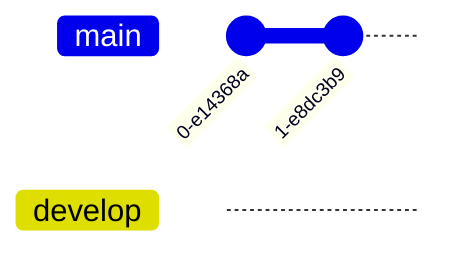

# Yêu cầu
- Người chưa biết gì về git cũng có thể sử dụng được
- Có những phần chỉ có một vài cấp độ được xem
- Một người có thể có nhiều thiết bị
- Điện thoại không có sourcetree, submodule
- Các commit rác sẽ bị squash thành một vào cuối ngày
- Truy vấn được lịch sử: ngày viết kế hoạch và ngày kết thúc 
- Kết nối được với vault của nhiều người
- Tuỳ chọn:
	- Có autosave và autosync
	- Có thể cấp read hoặc write
## Đồng bộ file
### Quan trọng: Cần giữ đồng bộ giữa nhiều người
| File                            | Mô tả                                  | Cần giữ đồng bộ giữa các thiết bị của cùng một người | Dễ gây xung đột |
| ------------------------------- | -------------------------------------- | ---------------------------------------------------- | --------------- |
| app.json                        | mobile toolbar buttons                 | ✔                                                    |                 |
| appearance.json                 | dark/light theme, enabled css snippets |                                                      | ✔               |
| community-plugins.json          |                                        | ✔                                                    | ✔               |
| core-plugins.json               |                                        |                                                      |                 |
| hotkey.json                     |                                        |                                                      |                 |
|                                 |                                        |                                                      |                 |
| advanced-toolbar                |                                        | ✔                                                    |                 |
| dataview                        |                                        |                                                      |                 |
| better-inline-fields            |                                        | ✔                                                    |                 |
| buttons                         |                                        |                                                      |                 |
| folder-note-core                |                                        |                                                      |                 |
| folder-note-plugin              |                                        |                                                      |                 |
| google-calendar                 |                                        |                                                      |                 |
| multi-column-markdown           |                                        |                                                      |                 |
| metadata-menu                   |                                        |                                                      |                 |
| metaedit                        |                                        | ✔                                                    |                 |
| obsidian-another-quick-switcher |                                        |                                                      |                 |
| obsidian-banners                |                                        |                                                      |                 |
| obsidian-custom-frames          |                                        |                                                      |                 |
| obsidian-editor-shortcuts       |                                        |                                                      |                 |
| obsidian-git                    |                                        |                                                      |                 |
| obsidian-icon-folder            |                                        |                                                      |                 |
| obsidian-leaflet-plugin         |                                        |                                                      |                 |
| obsidian-party                  |                                        |                                                      |                 |
| obsidian-quickshare             |                                        |                                                      |                 |
| obsidian-version-history-diff   |                                        |                                                      |                 |
| quick-explorer                  |                                        |                                                      |                 |
| quickadd                        |                                        | ✔                                                    |                 |
| templater-obsidian              |                                        | ✔                                                    |                 |
| various-complements             |                                        | ✔                                                    | ✔               |

- Lúc đầu là tải folder .obsidian như ở upstream, nhưng sau đó không sync gì cả (ignore files), nhưng vẫn giữ quyền overwrite khi cần dùng
- lock edit Hoặc auto merge

[A Comparison Study for File Synchronisation](https://core.ac.uk/download/pdf/82255612.pdf)

## Khi có conflict
- Merge the rest files
- Keep two version 
## Lợi thế
- Luôn có wifi
- Khi có conflict thì cứ merge hết là được
- Chỉ là dữ liệu nên không phải quá lo lắng về final product. Không sợ bug
[[Plugin]]
# So sánh các giải pháp hiện nay
| Mục đích  | Tính năng                         | Google Drive | Syncthing | Git | S3  | P2P | IPFS | [vrtmrz/obsidian-livesync](https://github.com/vrtmrz/obsidian-livesync "vrtmrz/obsidian-livesync") |
| --------- | --------------------------------- | ------------ | --------- | --- | --- | --- | ---- | -------------------------------------------------------------------------------------------------- |
|           | <h3>Quản lý file</h3>             |              |           |     |     |     |      |                                                                                                    |
| .obsidian | Ignore file                       | ❌           | ✔         | ✔   | ✔   |     |      |                                                                                                    |
|           | Cho phép admin overwrite          |              |           |     |     |     |      |                                                                                                    |
|           | Sync cho iOS                      | ❌           | ❌        | ✔   | ✔   |     |      |                                                                                                    |
|           | Dễ xử lý conflict                 | ✔            | 5         | 3   |     |     |      |                                                                                                    |
|           | Cấp quyền đọc hay ghi nhanh chóng | ✔            | ❌        | ❓  |     |     |      |                                                                                                    |
|           | Cấp quyền truy cập thư mục con    | ❌           | ✔         | ✔   |     |     |      |                                                                                                    |
|           | UX thân thiện                     | ✔            | ❌        | ❌  |     |     |      |                                                                                                    |
|           | Quản lý conflict                  | ✔            |           |     |     |     |      |                                                                                                    |
|           | Dễ setup                          | ✔            |           |     |     |     |      |                                                                                                    |
|           | Làm trên điện thoại               | ✔            |           |     |     |     |      |                                                                                                    |
|           | Nhiều cách sync                   | ❌           | ✔         |     |     |     |      |                                                                                                    |
|           | Không cần cài app khác            | ✔            | ❌        | ✔   | ✔   |     |      |                                                                                                    |
|           | <h3>Quản lý người, thiết bị</h3>  |              |           |     |     |     |      |                                                                                                    |
#  Thiết kế
- Auto push lên nhánh autosave
- Nhánh main dùng để chứa custom commit
- auto pull main
- auto merge
- Nhánh autosave phải luôn có phiên bản mới nhất của main
- Không cần chia branch

## Lợi ích
- Có thể tạo báo cáo tự động, không cần phải làm thủ công
- Xem được lịch sử ngày giờ người thay đổi từng ngày
## Message
- Khi thay đổi cấu trúc folder
- Sau mỗi lần họp
- Thay đổi kết quả mong muốn hoặc công việc
## Tag

## Phụ
