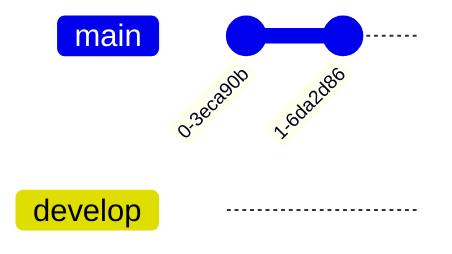

# Yêu cầu
- Người chưa biết gì về git cũng có thể sử dụng được
- Có những phần chỉ có một vài cấp độ được xem
- Một người có thể có nhiều thiết bị
- Điện thoại không có sourcetree, submodule
- Các commit rác sẽ bị squash thành một vào cuối ngày
- Truy vấn được lịch sử: ngày viết kế hoạch và ngày kết thúc 
- Kết nối được với vault của nhiều người
- Tuỳ chọn:
	- Có autosave và autosync
	- Có thể cấp read hoặc write
## Đồng bộ file
### Quan trọng: Cần giữ đồng bộ giữa nhiều người
| File                            | Mô tả                                  | Cần giữ đồng bộ giữa các thiết bị của cùng một người | Dễ gây xung đột |
| ------------------------------- | -------------------------------------- | ---------------------------------------------------- | --------------- |
| app.json                        | mobile toolbar buttons                 | ✔                                                    |                 |
| appearance.json                 | dark/light theme, enabled css snippets |                                                      | ✔               |
| community-plugins.json          |                                        | ✔                                                    | ✔               |
| core-plugins.json               |                                        |                                                      |                 |
| hotkey.json                     |                                        |                                                      |                 |
| .git                            |                                        |                                                      |                 |
|                                 |                                        |                                                      |                 |
| advanced-toolbar                |                                        | ✔                                                    |                 |
| dataview                        |                                        |                                                      |                 |
| better-inline-fields            |                                        | ✔                                                    |                 |
| buttons                         |                                        |                                                      |                 |
| folder-note-core                |                                        |                                                      |                 |
| folder-note-plugin              |                                        |                                                      |                 |
| google-calendar                 |                                        |                                                      |                 |
| multi-column-markdown           |                                        |                                                      |                 |
| metadata-menu                   |                                        |                                                      |                 |
| metaedit                        |                                        | ✔                                                    |                 |
| obsidian-another-quick-switcher |                                        |                                                      |                 |
| obsidian-banners                |                                        |                                                      |                 |
| obsidian-custom-frames          |                                        |                                                      |                 |
| obsidian-editor-shortcuts       |                                        |                                                      |                 |
| obsidian-git                    |                                        |                                                      |                 |
| obsidian-icon-folder            |                                        |                                                      |                 |
| obsidian-leaflet-plugin         |                                        |                                                      |                 |
| obsidian-party                  |                                        |                                                      |                 |
| obsidian-quickshare             |                                        |                                                      |                 |
| obsidian-version-history-diff   |                                        |                                                      |                 |
| quick-explorer                  |                                        |                                                      |                 |
| quickadd                        |                                        | ✔                                                    |                 |
| templater-obsidian              |                                        | ✔                                                    |                 |
| various-complements             |                                        | ✔                                                    | ✔               |

### Có thể tắt
| workspace-mobile.json           |                                   | ✔               |
| workspace.json                  |                                   | ✔               |
obsidian-commits
recent-files-obsidian
auto-note-mover
breadcrumbs
cm-editor-syntax-highlight-obsidian
copy-url- in-preview
dbfolder
graph-analysis
heatmap-calendar
hot-reload
import-into-obsidian
language-translator
mrj-jump-to-link
nldates-obsidian
note-refactor-obsidian
notion-like-tables
obsidian-admonition
obsidian-advanced-slides
obsidian-argdown-plugin
obsidian-auto-link-title
obsidian-autocomplete-plugin
obsidian-chartsview-plugin
obsidian-database-plugin
obsidian-day-planner
obsidian-divide-and-conquer
obsidian-embedded-note-titles
obsidian-excalidraw-plugin
obsidian-filename-heading-sync
obsidian-frontmatter-tag-suggest
obsidian-full-calendar
obsidian-graphviz
obsidian-heading-shifter
obsidian-import-json
obsidian-kanban
obsidian-list-modified
obsidian-projects
obsidian-regex-pipeline
obsidian-regex-replace
obsidian-shellcommands
obsidian-snippet-downloader
obsidian-style-settings
obsidian-tabs
obsidian-tasks-plugin
obsidian-user-plugins
obsidian-wikipedia
obsidian42-brat
open-with
plugin
search-on-internet
supercharged-links-obsidian
table-editor-obsidian
tag-word-cloud
tag-wrangler
- Lúc đầu là tải folder .obsidian như ở upstream, nhưng sau đó không sync gì cả (ignore files), nhưng vẫn giữ quyền overwrite khi cần dùng
- lock edit Hoặc auto merge

| Cấp độ               | Nhu cầu                                               | Dữ liệu chính       | app.json                     | appearance.json              | workspace                    | data.json | .gitignore | communityplugins.json | plugins | Giải pháp                       |
| -------------------- | ----------------------------------------------------- | ------------------- | ---------------------------- | ---------------------------- | ---------------------------- | --------- | ---------- | --------------------- | ------- | ------------------------------- |
| Mới biết về Obsidian | Biết tổng thể có gì, không cần phải cập nhật liên tục | 1-way               | Tải về lần đầu sau đó ignore | Tải về lần đầu sau đó ignore | Tải về lần đầu sau đó ignore | 1-way     |            | 1-way                 | 1-way   | Đưa link google drive để tải về |
| Biết sơ sơ           | Cập nhật để nắm tình hình nhóm tốt hơn                | 2-way gỡ chặn PR | ignore                       | ignore                       | ignore                       | 1-way     |            | 1-way                 | 1-way   |                                 |
| Đã rành về plugin    | Chỉnh sửa                                             | 2-way               | ignore                       | ignore                       | ignore                       | ignore    |            | 1-way                 | 1-way   |                                 |

[A Comparison Study for File Synchronisation](https://core.ac.uk/download/pdf/82255612.pdf)

## Khi có conflict
- Merge the rest files
- Keep two version 
## Lợi thế
- Luôn có wifi
- Khi có conflict thì cứ merge hết là được
- Chỉ là dữ liệu nên không phải quá lo lắng về final product. Không sợ bug
[[Plugin]]
# So sánh các giải pháp hiện nay
| Mục đích  | Tính năng                         | Google Drive | Syncthing | Git | S3  | P2P | IPFS | [vrtmrz/obsidian-livesync](https://github.com/vrtmrz/obsidian-livesync "vrtmrz/obsidian-livesync") |
| --------- | --------------------------------- | ------------ | --------- | --- | --- | --- | ---- | -------------------------------------------------------------------------------------------------- |
|           | <h3>Quản lý file</h3>             |              |           |     |     |     |      |                                                                                                    |
| .obsidian | Ignore file                       | ❌           | ✔         | ✔   | ✔   |     |      |                                                                                                    |
|           | Cho phép admin overwrite          |              |           |     |     |     |      |                                                                                                    |
|           | Sync cho iOS                      | ❌           | ❌        | ✔   | ✔   |     |      |                                                                                                    |
|           | Dễ xử lý conflict                 | ✔            | 5         | 3   |     |     |      |                                                                                                    |
|           | Cấp quyền đọc hay ghi nhanh chóng | ✔            | ❌        | ❓  |     |     |      |                                                                                                    |
|           | Cấp quyền truy cập thư mục con    | ❌           | ✔         | ✔   |     |     |      |                                                                                                    |
|           | UX thân thiện                     | ✔            | ❌        | ❌  |     |     |      |                                                                                                    |
|           | Quản lý conflict                  | ✔            |           |     |     |     |      |                                                                                                    |
|           | Dễ setup                          | ✔            |           |     |     |     |      |                                                                                                    |
|           | Làm trên điện thoại               | ✔            |           |     |     |     |      |                                                                                                    |
|           | Nhiều cách sync                   | ❌           | ✔         |     |     |     |      |                                                                                                    |
|           | Không cần cài app khác            | ✔            | ❌        | ✔   | ✔   |     |      |                                                                                                    |
|           | <h3>Quản lý người, thiết bị</h3>  |              |           |     |     |     |      |                                                                                                    |
#  Thiết kế
- Auto push lên nhánh autosave
- Nhánh main dùng để chứa custom commit
- auto pull main
- auto merge
- Nhánh autosave phải luôn có phiên bản mới nhất của main
- Không cần chia branch

## Lợi ích
- Có thể tạo báo cáo tự động, không cần phải làm thủ công
- Xem được lịch sử ngày giờ người thay đổi từng ngày
## Message
- Khi thay đổi cấu trúc folder
- Sau mỗi lần họp
- Thay đổi mục tiêu hoặc công việc
## Tag

## Phụ
