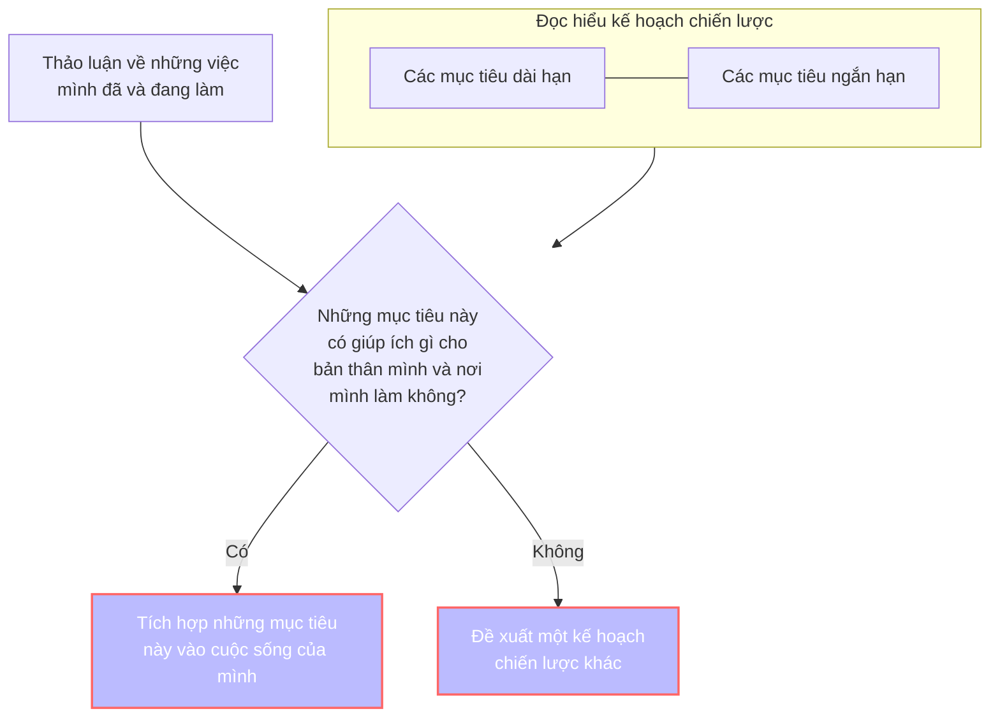
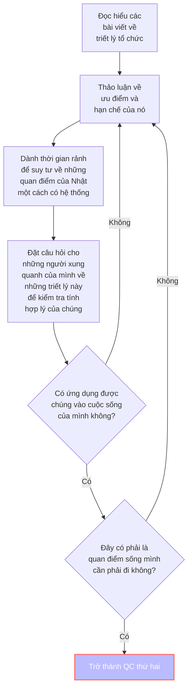

> [!Tip] Sự thú vị đầu tiên của Obsidian
> Hãy thử bấm <kbd>Ctrl + E</kbd> vài lần để xem chuyện gì sẽ xảy ra

![[Cách vận hành.png]]
Mục tiêu của bản đồ này là đẩy thành viên trở thành [[Một đám mây chim sáo]], để họ có thể xé cái bản đồ này đi và làm cái của riêng họ. Họ sẽ làm được điều đó khi họ:
- Hiểu kế hoạch chiến lược
- Hiểu triết lý tổ chức
- Hiểu cách vận hành hiện tại
- Tương tác với mọi người
- Sử dụng dữ liệu

> [!Tip] Bấm <kbd>Alt + O</kbd> để hiển thị mục lục

# Hiểu kế hoạch chiến lược
2. Viết bản kế hoạch 1 năm cho bản thân mình
1. Đọc hiểu:
- [[2 Các vùng đất (Sản phẩm và mục tiêu)|Các mục tiêu dài hạn]]
- [[00.2 Kế hoạch tổng thể|Các mục tiêu ngắn hạn]]
3. Tìm xem những bản kế hoạch này giao với nhau ở những điểm nào

# Hiểu triết lý tổ chức
1. Đọc hiểu các bài sau:
	1. Tư duy, thái độ, ...
		- [[Một đám mây chim sáo]]
		- [[Sự trong trong]]
		- [[Truyện Ngụ Ngôn về Người Nhật – Phần Một (chưa chắc có Phần Hai)]]
			- [[66 Hướng dẫn xử lý các trường hợp cụ thể]]
		- [Mở đầu](https://xn--qucu-hr5aza.cc/mo-dau/?utm_source=Obsidian+Qu%E1%BA%A3+C%E1%BA%A7u+%C2%BB+B%E1%BA%A3n+%C4%91%E1%BB%93+trong+QC&utm_medium=M%E1%BB%9F+%C4%91%E1%BA%A7u&utm_campaign=Giai+%C4%91o%E1%BA%A1n+1)
	2. Các khái niệm quan trọng khác
		- [Sự bất lực học được](https://xn--qucu-hr5aza.cc/su-bat-luc-hoc-duoc/?utm_source=Obsidian+Qu%E1%BA%A3+C%E1%BA%A7u+%C2%BB+B%E1%BA%A3n+%C4%91%E1%BB%93+trong+QC&utm_medium=S%E1%BB%B1+b%E1%BA%A5t+l%E1%BB%B1c+h%E1%BB%8Dc+%C4%91%C6%B0%E1%BB%A3c+l%C3%A0+g%C3%AC%3F&utm_campaign=Giai+%C4%91o%E1%BA%A1n+1)
		- [[Niềm tin tiêu cực]] 
2. Thảo luận về ưu điểm và hạn chế của nó
3. Dành thời gian rảnh để suy tư về những quan điểm của Nhật một cách có hệ thống
4. Đặt câu hỏi cho những người xung quanh của mình về những triết lý này để kiểm tra tính hợp lý của chúng
5. Ứng dụng chúng vào cuộc sống của mình
6. Cảm thấy đây là quan điểm sống mình cần phải đi
7. Nếu như 5, 6 không hiệu quả hoặc khả thi thì quay lại 2

# Hiểu cách sự vận hành hiện tại
Hiểu được, nắm được, biết được:
- [[2 Các vùng đất (Sản phẩm và mục tiêu)|Kế hoạch dài hạn của QC]]
- [[62 Thành viên (Người chơi)|Hồ sơ công việc của mình và của các thành viên khác]]
- [[Cách tìm công việc phù hợp với mình nhất]]
- [[66 Hướng dẫn xử lý các trường hợp cụ thể|Cách xử lý các tình huống khác nhau trong quá trình làm việc]]
- [[Hướng dẫn truyền thông|Cách khi giới thiệu cho người ngoài]] 
# Tương tác với mọi người
1. Tham gia [[00.1 Lịch họp hằng tuần|các buổi họp hằng tuần]]
2. Tham gia [Discord](https://discord.gg/jWTk4EHFK2)
3. Tham gia [Facebook group](https://www.facebook.com/groups/thaydoiniemtintieucuc/)
4. Chia sẻ trên Discord/group
	- Giới thiệu bản thân
	- Chia sẻ với mọi người về những gì mình đã, đang và sẽ làm/cần trong vòng 1 tháng qua và 1 tháng tới
	- Những bài viết mình thấy thú vị
	- Những suy tư về cuộc sống của mình
5. Điền thông tin vào hồ sơ của mình
6. Xem hồ sơ của những thành viên khác và xem xem mình có thể làm được gì cho họ
7. Làm khảo sát [Bạn nghĩ gì về Quả Cầu?](https://quảcầu.cc/ban-nghi-gi-ve-qua-cau/?utm_source=Obsidian+Qu%E1%BA%A3+C%E1%BA%A7u+%C2%BB+B%E1%BA%A3n+%C4%91%E1%BB%93+trong+QC&utm_medium=B%E1%BA%A1n+ngh%C4%A9+g%C3%AC+v%E1%BB%81+Qu%E1%BA%A3+C%E1%BA%A7u%3F&utm_campaign=Giai+%C4%91o%E1%BA%A1n+1)
# Sử dụng dữ liệu
1. Đọc [[00 Hướng dẫn sử dụng Obsidian]]
2. Đồng bộ vault cho máy tính, cho điện thoại
3. Hiểu được trong vault có những thư mục nào
4. Chỉnh sửa lần đầu
5. Tự động tìm câu trả lời trong vault chứ không hỏi Nhật nữa
6. Hỗ trợ người khác tìm thông tin trong vault
7. [[04 Đồng bộ dữ liệu|Tìm hiểu về git]]
8. Sử dụng Git
9. Tạo một vault cho riêng mình

# Với người muốn tham gia *Mạng lưới người thân, bạn bè của người có niềm tin tiêu cực*
1. Làm [Khảo sát quan điểm về sự tác động](https://xn--qucu-hr5aza.cc/khao-sat-quan-diem-ve-su-tac-dong/?utm_source=Obsidian+Qu%E1%BA%A3+C%E1%BA%A7u+%C2%BB+B%E1%BA%A3n+%C4%91%E1%BB%93+trong+QC&utm_medium=Kh%E1%BA%A3o+s%C3%A1t+quan+%C4%91i%E1%BB%83m+v%E1%BB%81+s%E1%BB%B1+t%C3%A1c+%C4%91%E1%BB%99ng&utm_campaign=Giai+%C4%91o%E1%BA%A1n+1)
2. Xem phim [12 người đàn ông giận dữ](https://phimnhua.com/xem-phim/12-nguoi-dan-ong-gian-du-12-angry-men-1957/)

