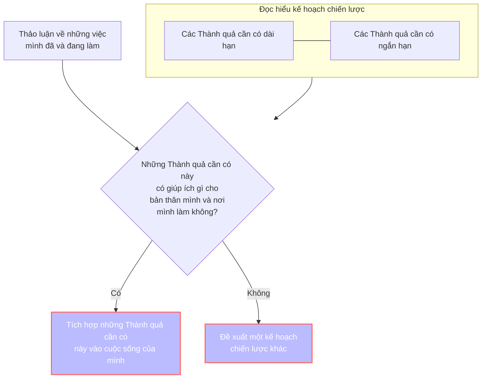

Sau khi bạn đã [[Hiểu chính bản thân mình]] và [[Hiểu Thành quả cần có và cách Quả Cầu hoạt động]], bạn hãy tìm xem hai cái đó giao với nhau ở những điểm nào. Bạn có thể đề xuất một bản kế hoạch mới cho Quả Cầu nếu bạn thấy chưa có điểm chung.

