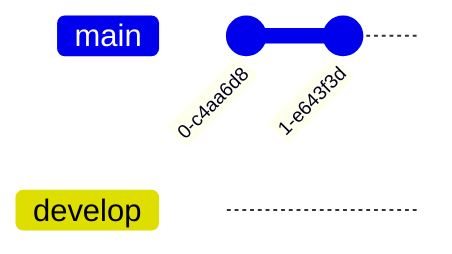

# Sync
| Mục đích  | Tính năng                         | Google Drive | Syncthing | Git | S3  | P2P | IPFS |
| --------- | --------------------------------- | ------------ | --------- | --- | --- | --- | ---- |
|           | <h3>Quản lý file</h3>             |              |           |     |     |     |      |
| .obsidian | Ignore file                       | ❌           | ✔         | ✔   | ✔   |     |      |
|           | Cho phép admin overwrite          |              |           |     |     |     |      |
|           | Sync cho iOS                      | ❌           | ❌        | ✔   | ✔   |     |      |
|           | Dễ xử lý conflict                 | ✔            | 5         | 3   |     |     |      |
|           | Cấp quyền đọc hay ghi nhanh chóng | ✔            | ❌        | ❓  |     |     |      |
|           | Cấp quyền truy cập thư mục con    | ❌           | ✔         | ✔   |     |     |      |
|           | UX thân thiện                     | ✔            | ❌        | ❌  |     |     |      |
|           | Dễ setup                          | ✔            |           |     |     |     |      |
|           | Làm trên điện thoại               | ✔            |           |     |     |     |      |
|           | Nhiều cách sync                   | ❌           | ✔         |     |     |     |      |
|           | Không cần cài app khác            | ✔            | ❌        | ✔   | ✔   |     |      |
|           | <h3>Quản lý người, thiết bị</h3>  |              |           |     |     |     |      |
- Lúc đầu là tải folder .obsidian như ở upstream, nhưng sau đó không sync gì cả (ignore files), nhưng vẫn giữ quyền overwrite khi cần dùng
- lock edit Hoặc auto merge
https://www.google.com/url?q=https://core.ac.uk/download/pdf/82255612.pdf&sa=U&ved=2ahUKEwjl26Dm0rr6AhUOAd4KHYJ0A0wQFnoECAAQAg&usg=AOvVaw1OdTPN0T8UAs7vA337nRJl

<iframe width="560" height="315" src="https://www.youtube.com/embed/DjYbsq3FXfM" title="YouTube video player" frameborder="0" allow="accelerometer; autoplay; clipboard-write; encrypted-media; gyroscope; picture-in-picture" allowfullscreen></iframe>

[Tải Git](https://git-scm.com/downloads). Hướng dẫn sử dụng: [Learn Git Branching](https://learngitbranching.js.org/)

# Yêu cầu git
- Có autosave và autosync
- Người chưa biết gì về git cũng có thể sử dụng được
- Có những phần chỉ có một vài cấp độ được xem
- Một người có thể có nhiều thiết bị
- Điện thoại không có sourcetree
- Các commit rác sẽ bị squash thành một vào cuối ngày
- Truy vấn được lịch sử: ngày viết kế hoạch và ngày kết thúc 
- Kết nối được với vault của nhiều người
- Không cần chia branch
- Tuỳ chọn:
	- Có thể cấp read hoặc write
#  Thiết kế
- Auto push lên nhánh autosave
- Nhánh main dùng để chứa custom commit
- auto pull main
- auto merge
- Nhánh autosave phải luôn có phiên bản mới nhất của main

       checkout develop
       commit
       commit
       checkout main
       merge develop
       commit
       commit

# Lợi ích
- Có thể tạo báo cáo tự động, không cần phải làm thủ công
- Xem được lịch sử ngày giờ người thay đổi từng ngày
# Message
- Khi thay đổi cấu trúc folder
- Sau mỗi lần họp
- Thay đổi mục tiêu hoặc công việc
# Tag

# Phụ
