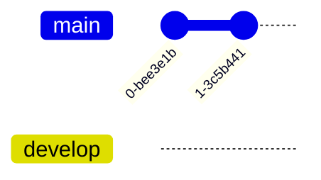

# Sync
| Mục đích  | Tính năng                         | Google Drive | Syncthing | Git | S3  | P2P | IPFS | [vrtmrz/obsidian-livesync](https://github.com/vrtmrz/obsidian-livesync "vrtmrz/obsidian-livesync") |
| --------- | --------------------------------- | ------------ | --------- | --- | --- | --- | ---- | -------------------------------------------------------------------------------------------------- |
|           | <h3>Quản lý file</h3>             |              |           |     |     |     |      |                                                                                                    |
| .obsidian | Ignore file                       | ❌           | ✔         | ✔   | ✔   |     |      |                                                                                                    |
|           | Cho phép admin overwrite          |              |           |     |     |     |      |                                                                                                    |
|           | Sync cho iOS                      | ❌           | ❌        | ✔   | ✔   |     |      |                                                                                                    |
|           | Dễ xử lý conflict                 | ✔            | 5         | 3   |     |     |      |                                                                                                    |
|           | Cấp quyền đọc hay ghi nhanh chóng | ✔            | ❌        | ❓  |     |     |      |                                                                                                    |
|           | Cấp quyền truy cập thư mục con    | ❌           | ✔         | ✔   |     |     |      |                                                                                                    |
|           | UX thân thiện                     | ✔            | ❌        | ❌  |     |     |      |                                                                                                    |
|           | Quản lý conflict                  | ✔            |           |     |     |     |      |                                                                                                    |
|           | Dễ setup                          | ✔            |           |     |     |     |      |                                                                                                    |
|           | Làm trên điện thoại               | ✔            |           |     |     |     |      |                                                                                                    |
|           | Nhiều cách sync                   | ❌           | ✔         |     |     |     |      |                                                                                                    |
|           | Không cần cài app khác            | ✔            | ❌        | ✔   | ✔   |     |      |                                                                                                    |
|           | <h3>Quản lý người, thiết bị</h3>  |              |           |     |     |     |      |                                                                                                    |
- Lúc đầu là tải folder .obsidian như ở upstream, nhưng sau đó không sync gì cả (ignore files), nhưng vẫn giữ quyền overwrite khi cần dùng
- lock edit Hoặc auto merge

<<<<<<< HEAD
| Cấp độ               | Nhu cầu                                               | Dữ liệu chính       | app.json                     | appearance.json              | workspace                    | data.json | .gitignore | communityplugins.json | plugins | Giải pháp                       |
| -------------------- | ----------------------------------------------------- | ------------------- | ---------------------------- | ---------------------------- | ---------------------------- | --------- | ---------- | --------------------- | ------- | ------------------------------- |
| Mới biết về Obsidian | Biết tổng thể có gì, không cần phải cập nhật liên tục | 1-way               | Tải về lần đầu sau đó ignore | Tải về lần đầu sau đó ignore | Tải về lần đầu sau đó ignore | 1-way     |            | 1-way                 | 1-way   | Đưa link google drive để tải về |
| Biết sơ sơ           | Cập nhật để nắm tình hình nhóm tốt hơn                | 2-way gỡ chặn PR | ignore                       | ignore                       | ignore                       | 1-way     |            | 1-way                 | 1-way   |                                 |
| Đã rành về plugin    | Chỉnh sửa                                             | 2-way               | ignore                       | ignore                       | ignore                       | ignore    |            | 1-way                 | 1-way   |                                 |
=======
| Cấp độ               | Dữ liệu chính       | app.json                     | appearance.json              | workspace                    | data.json | .gitignore | communityplugins.json | plugins |
| -------------------- | ------------------- | ---------------------------- | ---------------------------- | ---------------------------- | --------- | ---------- | --------------------- | ------- |
| Mới biết về Obsidian | 1-way chặn PR    | Tải về lần đầu sau đó ignore | Tải về lần đầu sau đó ignore | Tải về lần đầu sau đó ignore | 1-way     |            | 1-way                 | 1-way   |
| Biết sơ sơ           | 2-way gỡ chặn PR | ignore                       | ignore                       | ignore                       | 1-way     |            | 1-way                 | 1-way   |
| Đã rành về plugin    | 2-way               | ignore                       | ignore                       | ignore                       | ignore    |            | 1-way                 | 1-way   |
>>>>>>> 0dd7b9769410df53fcdac556a3adb8a3853db5cf

[A Comparison Study for File Synchronisation](https://core.ac.uk/download/pdf/82255612.pdf)

## Khi có conflict
- Merge the rest files
- Keep two version 

## Yêu cầu git
- Có autosave và autosync
- Người chưa biết gì về git cũng có thể sử dụng được
- Có những phần chỉ có một vài cấp độ được xem
- Một người có thể có nhiều thiết bị
- Điện thoại không có sourcetree
- Các commit rác sẽ bị squash thành một vào cuối ngày
- Truy vấn được lịch sử: ngày viết kế hoạch và ngày kết thúc 
- Kết nối được với vault của nhiều người
- Không cần chia branch
- Tuỳ chọn:
	- Có thể cấp read hoặc write
##  Thiết kế
- Auto push lên nhánh autosave
- Nhánh main dùng để chứa custom commit
- auto pull main
- auto merge
- Nhánh autosave phải luôn có phiên bản mới nhất của main

       checkout develop
       commit
       commit
       checkout main
       merge develop
       commit
       commit

## Lợi ích
- Có thể tạo báo cáo tự động, không cần phải làm thủ công
- Xem được lịch sử ngày giờ người thay đổi từng ngày
## Message
- Khi thay đổi cấu trúc folder
- Sau mỗi lần họp
- Thay đổi mục tiêu hoặc công việc
## Tag

## Phụ
# Lợi thế
- Luôn có wifi
- Khi có conflict thì cứ merge hết là được
- Chỉ là dữ liệu nên không phải quá lo lắng về final product. Không sợ bug