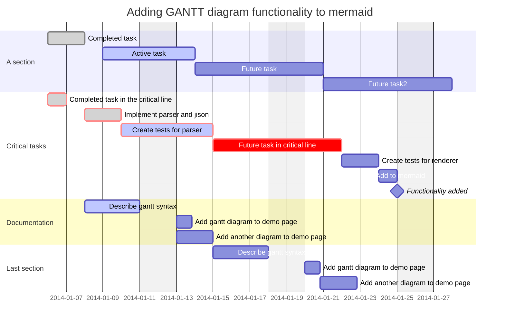

# 1 Lên kế hoạch
## Giới thiệu chương trình
## Phiếu đăng ký tham gia chương trình
## Danh sách người đăng ký
## Quỹ chương trình
- Dự trù kinh phí
- Báo cáo chi tiêu
## Kế hoạch hoạt động chi tiết
- Buổi 1
- Buổi 2
- ...
## Đánh giá rủi ro
## Giấy tờ gửi các bên liên quan
- Nhà tài trợ
- Đơn vị hỗ trợ
- Đơn vị bảo trợ

## Tài liệu về các bên liên quan
- Nhà tài trợ
- Đơn vị hỗ trợ
- Đơn vị bảo trợ

## Yêu cầu của các bên liên quan
- Nhà tài trợ
- Đơn vị hỗ trợ
- Đơn vị bảo trợ

# 2 Bài đăng, email trước tập huấn
## Page: Hé lộ chương trình mới
-  Ảnh
-  Nội dung
## Page: Mở đơn chính thức
- Ảnh
- Nội dung
## Group: Đăng bài trong các nhóm
## Page: Những điều thú vị ở nơi sự kiện diễn ra
-  Ảnh
-  Nội dung
## Page: Bật mí BTC
-  Ảnh
-  Nội dung
## Page: Còn một ngày để đăng ký
-  Ảnh
-  Nội dung: một câu chuyện thú vị
## Email: Thông báo kết quả ứng tuyển
-  Cho người được chọn
	- Chuyển tiền cam kết
-  Cho người bị loại
## Page: Thông báo kết quả email
-  Ảnh
-  Nội dung
- 
## Điện thoại: Nhắc xác nhận tham gia
## Email: Xác nhận cam kết tham gia
-  Chọn lịch tập huấn
-  Chọn lịch làm quen
## Điện thoại: Nhắc điền lịch
## Page: Tập huấn sắp bắt đầu
-  Ảnh
-  Nội dung

## Page: Bài truyền thông cho các bên liên quan
-  Ảnh
-  Nội dung

# 3 Chuẩn bị cho người tham gia trước khi đi
## Email: Chốt lịch tập huấn và làm quen
- Google Calendars
## Làm nội dung tập huấn online
## Tổ chức buổi tập huấn online
## Tổ chức buổi làm quen offline
## Page: Recap buổi tập huấn
-  Ảnh
-  Nội dung
## Thiết kế băng rôn, standee chương trình
## Group: Thông tin cần nhớ trước khi đi
-  Ảnh
-  Nội dung
## Làm danh sách tham gia cuối cùng

# 4 Công việc trong chuyến đi
## Thuê xe
## Đi chợ
## Nấu ăn
## Dọn dẹp
## Chụp ảnh
- Người tham gia
- Hoạt động 1
- Hoạt động 2
- Hoạt động 3
- Người bản địa
- Bên liên quan 1
- Bên liên quan 2
- Bên liên quan 3

## Ký giấy tờ
- Thuê nhà
- Đồ ăn, nước
- Xe
- Hướng dẫn viên

# 5 Công việc sau chuyến đi
## Làm phiếu lượng giá
## Tìm hiểu nhu cầu của người tham gia về bài truyền thông và bài thu hoạch
## Truyền thông 
## Email: Thư cảm ơn các bên hỗ trợ
## Lọc ảnh
- Xếp tất cả các ảnh theo ngày
## Làm giấy chứng nhận

# 6 Chuẩn bị cho chương trình năm sau
